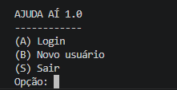
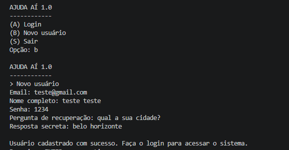
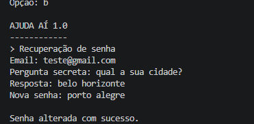
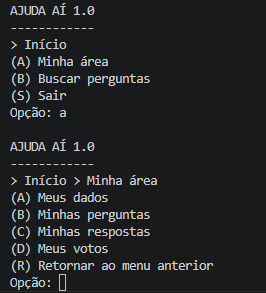
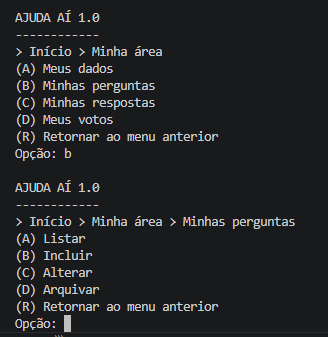
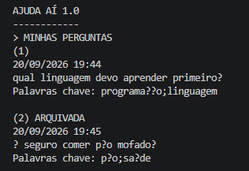

# AJUDA AÍ 1.0

Trabalho Prático 1 da disciplina **Algoritmos e Estruturas de Dados III**.

O projeto implementa a primeira etapa de um sistema de perguntas e respostas em interface textual, com persistência em arquivos, CRUD de usuários, CRUD de perguntas, autenticação, recuperação de senha e relacionamento 1:N entre usuários e perguntas.

## Participantes

- **Rafael Caricatti**
- **Renan Vieira**
- **Savio Faria**
- **Letícia Gonçalves Farias** 

## Descrição do sistema

O **AJUDA AÍ 1.0** é uma aplicação Java executada pelo terminal. Nesta etapa do projeto, o sistema permite cadastrar usuários, realizar login, recuperar a senha por meio de uma pergunta secreta, alterar os dados do usuário e gerenciar as perguntas vinculadas à conta autenticada.

Cada pergunta pertence a um único usuário por meio do atributo `idUsuario`. O caminho inverso, isto é, descobrir todas as perguntas pertencentes a determinado usuário, é realizado com uma **Árvore B+** persistente, utilizando o par `[idUsuario, idPergunta]`.

O sistema também utiliza uma **Tabela Hash Extensível** como índice indireto de e-mail dos usuários, permitindo localizar o usuário a partir de seu e-mail sem percorrer sequencialmente o arquivo principal.

As opções **Buscar perguntas**, **Minhas respostas** e **Meus votos** aparecem nos menus porque fazem parte da estrutura geral da aplicação, mas não são implementadas neste TP, pois pertencem às próximas etapas do projeto.

## Funcionalidades implementadas

### Usuários

O sistema permite:

- cadastrar um novo usuário;
- impedir o cadastro de e-mails duplicados;
- realizar login por e-mail e senha;
- armazenar senha por meio de hash SHA-256;
- armazenar a resposta secreta também por hash;
- normalizar a resposta secreta antes da geração do hash, removendo acentos e convertendo o texto para letras minúsculas;
- recuperar a senha utilizando a pergunta e a resposta secreta;
- alterar nome;
- alterar e-mail;
- alterar senha;
- alterar pergunta e resposta de recuperação.

### Perguntas

O usuário autenticado pode:

- listar suas próprias perguntas;
- incluir uma pergunta;
- alterar o texto e as palavras-chave de uma pergunta ativa;
- arquivar uma pergunta;
- continuar visualizando suas perguntas arquivadas;
- visualizar as perguntas por uma numeração sequencial, sem exposição dos IDs internos.

O arquivamento é definitivo. Em vez de excluir fisicamente a pergunta, o atributo `ativa` recebe o valor `false`. Dessa forma, a pergunta continua associada ao seu autor e pode ser identificada na listagem como **ARQUIVADA**.

## Classes principais

| Classe | Responsabilidade |
|---|---|
| `Main` | Ponto de entrada da aplicação. |
| `InterfaceSistema` | Interface textual, menus, navegação e integração das funcionalidades. |
| `Usuario` | Entidade de usuário e sua serialização. |
| `Pergunta` | Entidade de pergunta e sua serialização. |
| `ArquivoUsuario` | CRUD especializado de usuários e índice indireto por e-mail. |
| `ControladorUsuario` | Cadastro, login, recuperação de senha e regras de usuário. |
| `ParEmailIdUsuario` | Par utilizado no índice extensível de e-mail para ID do usuário. |
| `Seguranca` | Geração de hash SHA-256 e normalização da resposta secreta. |
| `ArquivoPergunta` | CRUD especializado de perguntas e relacionamento usuário-pergunta. |
| `GerenciadorPerguntas` | Regras de inclusão, alteração, arquivamento e listagem das perguntas. |
| `aed3.Arquivo` | CRUD genérico utilizado como base, conforme disponibilizado na disciplina. |
| `aed3.HashExtensivel` | Tabela Hash Extensível utilizada nos índices. |
| `aed3.ArvoreBMais` | Árvore B+ disponibilizada pelo professor e utilizada no relacionamento 1:N. |
| `aed3.ParIdId` | Par de IDs utilizado na Árvore B+ para `[idUsuario, idPergunta]`. |
| `TestePerguntas` | Testes das operações de perguntas. |
| `TesteIntegracao` | Teste integrado das principais funcionalidades do sistema. |

## Operações especiais implementadas

### Índice de e-mail

A classe `ArquivoUsuario` estende `Arquivo<Usuario>` e mantém um índice indireto por e-mail com `HashExtensivel<ParEmailIdUsuario>`.

Ao cadastrar um usuário, o sistema verifica se o e-mail já está presente no índice. Na alteração de e-mail, a entrada antiga é removida e uma nova associação é criada com o novo e-mail e o mesmo ID do usuário.

### Segurança das senhas

A classe `Seguranca` utiliza **SHA-256** para gerar os hashes de senha e de resposta secreta.

Antes do hash da resposta secreta, o texto é normalizado por meio de `Normalizer`, removendo acentos, convertendo para letras minúsculas e removendo espaços excedentes nas extremidades. Isso possibilita comparar respostas equivalentes de maneira padronizada.

### Relacionamento 1:N

A classe `ArquivoPergunta` estende `Arquivo<Pergunta>` e utiliza a implementação de **Árvore B+ fornecida pelo professor**.

O relacionamento é armazenado com:

```text
[idUsuario, idPergunta]
```

Assim, um usuário pode possuir várias perguntas, enquanto cada pergunta possui apenas um `idUsuario`.

Quando uma pergunta é criada, o relacionamento também é incluído na árvore. Para listar as perguntas de um usuário, a aplicação consulta a Árvore B+ pelo `idUsuario` e recupera os IDs das perguntas associadas.

### Numeração sequencial na interface

Os IDs de usuário e de pergunta são utilizados apenas internamente. Na tela, as perguntas são exibidas como `(1)`, `(2)`, `(3)` etc.

Durante as operações de alteração e arquivamento, a interface mantém a associação entre o número mostrado ao usuário e o verdadeiro `idPergunta`, permitindo realizar a operação correta sem expor identificadores internos.

### Arquivamento

As perguntas não são excluídas pela interface. O método de arquivamento altera o campo:

```text
ativa = false
```

A pergunta continua vinculada ao usuário na Árvore B+, permitindo que o autor ainda a visualize com a indicação **ARQUIVADA**.

## Capturas de tela

### 1. Menu inicial



Tela inicial do sistema com as opções de login, novo usuário e saída.

### 2. Cadastro de usuário



Confirmação de que um novo usuário foi cadastrado com sucesso.

### 3. Login e recuperação de senha



Tela exibida após uma tentativa de login incorreta, mostrando a possibilidade de recuperar a senha.

### 4. Minha área



Menu da área pessoal do usuário, contendo o acesso aos dados e às perguntas.

### 5. Menu de perguntas



Menu de gerenciamento das perguntas, com as operações de listar, incluir, alterar e arquivar.

### 6. Listagem de perguntas



Listagem das perguntas do usuário com numeração sequencial, palavras-chave e pelo menos uma pergunta marcada como **ARQUIVADA**, sem exibição dos IDs internos.

## Como compilar e executar

A partir da pasta `CRUD2`:

```bash
javac -encoding UTF-8 aed3/*.java *.java
```

Para executar a aplicação:

```bash
java Main
```

Para executar os testes de perguntas:

```bash
java TestePerguntas
```

Para executar o teste de integração:

```bash
java TesteIntegracao
```

## Checklist obrigatório

### Há um CRUD de usuários (que estende a classe Arquivo, acrescentando Tabelas Hash Extensíveis e Árvores B+ como índices diretos e indiretos conforme necessidade) que funciona corretamente?

**Sim.** A classe `ArquivoUsuario` estende `Arquivo<Usuario>` e utiliza uma Tabela Hash Extensível para o índice indireto de e-mail. As operações de criação, consulta, atualização e exclusão estão integradas ao CRUD genérico.

### Há um CRUD de perguntas (que estende a classe Arquivo, acrescentando Tabelas Hash Extensíveis e Árvores B+ como índices diretos e indiretos conforme necessidade) que funciona corretamente?

**Sim.** A classe `ArquivoPergunta` estende `Arquivo<Pergunta>` e utiliza a Árvore B+ para manter o relacionamento entre usuário e pergunta. As operações de criação, consulta, atualização e exclusão existem no CRUD, enquanto a interface utiliza arquivamento em vez de exclusão física.

### As perguntas estão vinculadas aos usuários usando o idUsuario como chave estrangeira?

**Sim.** A entidade `Pergunta` possui o atributo `idUsuario`, preenchido automaticamente com o ID do usuário autenticado no momento do cadastro da pergunta.

### Há uma árvore B+ que registre o relacionamento 1:N entre usuários e perguntas?

**Sim.** O relacionamento é mantido pela classe `aed3.ArvoreBMais`, utilizando objetos `ParIdId` no formato `[idUsuario, idPergunta]`.

### O trabalho compila corretamente?

**Sim.** O projeto foi compilado em conjunto com as classes do pacote `aed3`, incluindo as classes de usuários, perguntas, interface e testes.

### O trabalho está completo e funcionando sem erros de execução?

**Sim, considerando o escopo definido para este TP.** As funcionalidades exigidas nesta etapa — usuários, autenticação, recuperação de senha, dados pessoais, gerenciamento de perguntas e relacionamento 1:N — estão integradas. As funcionalidades de busca de perguntas, respostas e votos são apresentadas apenas como opções de menu e estão reservadas para etapas posteriores do projeto.

### O trabalho é original e não a cópia de um trabalho de outro grupo?

**Sim.** A implementação das entidades, controles, integração e interface foi desenvolvida pelo grupo. As classes genéricas de estruturas de dados fornecidas pelo professor foram utilizadas conforme exigência do próprio trabalho prático.

## Observações finais

O sistema foi organizado de forma a separar as entidades, o acesso aos arquivos, as regras de negócio e a interface textual. A utilização do CRUD genérico, da Tabela Hash Extensível e da Árvore B+ permite manter os dados persistentes e os relacionamentos necessários para esta etapa do projeto.
